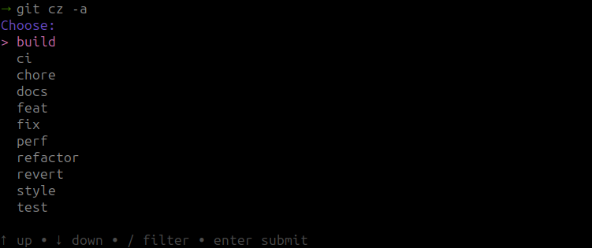
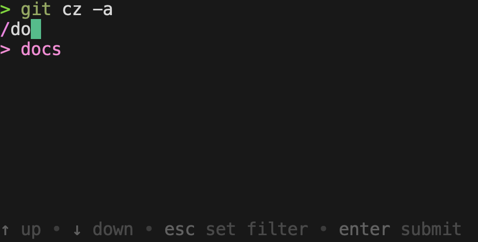
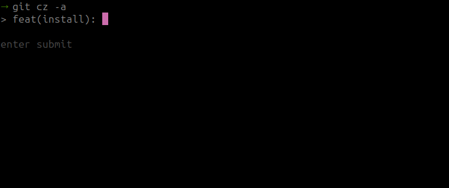
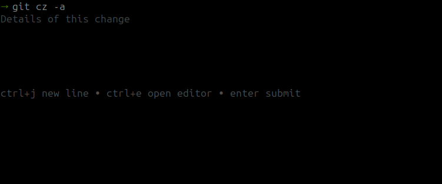
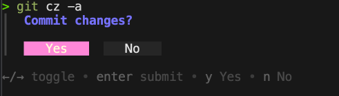
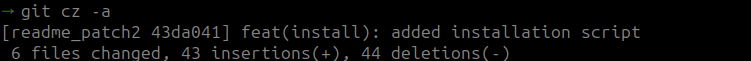

# git-cz

`git-cz` is a simple shell script that helps you create [conventional commits](https://www.conventionalcommits.org/en/v1.0.0/) with ease. It prompts you to select the type of commit, enter a scope (optional), and provide a summary and detailed description. The script can also automatically stage modified and deleted tracked files before committing.

## Features

- Prompts for commit type, scope, summary, and detailed description.
- Supports the `-a` flag to automatically stage modified and deleted files before committing.

## Dependencies

- **[Gum](https://github.com/charmbracelet/gum)**: A tool to make shell scripts more interactive. This script relies on `gum` to present choices and prompt for input.

### Installing Gum

To use `git-cz`, you need to have `gum` installed. Check the [official repository](https://github.com/charmbracelet/gum/tree/main?tab=readme-ov-file#installation) for installation instructions.

## Installation

1. Download the `git-cz` script.

    ```bash
    https://raw.githubusercontent.com/k3ii/git-cz/main/git-cz
    ```

2. Make the script executable.

    ```bash
    chmod +x git-cz
    ```

3. Move the script to a directory in your `PATH`.
To make the script accessible as a `git` command, move it to a directory in your `PATH`. A common choice is `/usr/local/bin`:

    ```bash
    sudo mv git-cz /usr/local/bin
    ```

4. Verify the installation.

    ```bash
    git cz -h
    ```

## Usage

The script supports the following options:

- -a: Automatically stage all modified and deleted tracked files before committing.
- -h: Display help information and usage instructions.

## Example

`git cz -a`  will prompt you to select a commit type, enter a scope, provide a summary,
and write a detailed description. It will then stage all modified and deleted files and commit them using the provided information

1. Running `git cz -a`
The different `types` will be displayed as a list of options. You can use the arrow keys to navigate and select the desired type.

    

2. Search/Filtering the `types`

    You can search/filter the `types` by typing the name of the type you are looking for.
    
3. After selecting the `type`, you will be prompted to enter the `scope` (optional).
    
4. Next, you will be prompted to enter a `summary` for the commit.  
    
5. Following the `summary`, you will be prompted to enter a `description` for the commit (optional).
    
6. After the `description`, you will be prompted to confirm the commit.
    
7. You can see what changes are committed.
    

## Conventional Commits

The [Conventional Commits](https://www.conventionalcommits.org/) specification is a convention for writing consistent commit messages. It helps in automating the release process, generating changelogs, and making it easier to understand the history of a project.

### Format

A conventional commit message has the following format:

```sh
<type>(<scope>): <summary>

<body>
```

- `type`: The type of change being committed, e.g., feat, fix, docs, etc.
- `scope` (optional): The part of the codebase that is being affected.
- `summary`: A brief summary of the change.
- `body` (optional): A detailed description of the change.

Benefits

- Automated Changelog: By following a consistent commit message format, tools can automatically generate changelogs.
- Better Collaboration: It makes it easier for teams to understand the nature of changes in the codebase.
- Semantic Versioning: Helps in determining the version of the project automatically based on the types of commits.

## How Git Picks Up git-cz

Git has a feature called "Git command aliases" that allows it to treat any executable file named `git-<command>` in your `PATH` as a Git subcommand. This is how `git-cz` works:

1. When you run `git cz`, Git looks for an executable file named `git-cz` in the directories listed in your PATH.
2. If it finds such a file (which is our script), Git executes it as if it were a built-in Git command.
3. This mechanism allows you to create custom Git commands without modifying Git itself.

By naming our script `git-cz` and placing it in a directory in the PATH, we're effectively creating a new Git command `cz` that can be invoked as `git cz`.
This approach is flexible and allows for easy installation and use across different projects without requiring project-specific configuration.

## See also

- [streamich/git-cz](https://github.com/streamich/git-cz)
- [Zhengqbbb/cz-git](https://github.com/Zhengqbbb/cz-git)

## Contributing

Feel free to improve the script to add your own commit types or make any other enhancements you think are useful. Contributions are welcome!

If you would like to contribute:

1. Fork the repository.
2. Create a new branch for your feature or fix.
3. Make your changes.
4. Submit a pull request.

Your contributions can help make this tool even more useful for everyone. Thank you for considering contributing!
